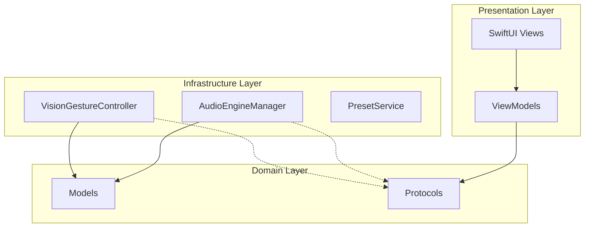

# RiffNode

<p align="center">
  
  
  
  
  
</p>

<p align="center">
  <b>Visual Guitar Effects Playground</b><br>
  A real-time guitar effects processor allowing hands-free control via head gestures, wrapped in a stunning Liquid Glass aesthetic.
</p>

---

## Features

### Real-Time Effects Processing
- **11 Professional Effect Types** organized by category:
  - **Dynamics**: Compressor
  - **Filter & Pitch**: EQ
  - **Gain/Dirt**: Overdrive, Distortion, Fuzz
  - **Modulation**: Chorus, Phaser, Flanger, Tremolo
  - **Time & Ambience**: Delay, Reverb
- Low-latency processing using `AVAudioEngine`
- **Signal Chain Customization**: Drag-and-drop ordering (e.g., placing Fuzz before Compressor)

### Hands-Free Vision Control
*Control your tone without taking your hands off the guitar.*
- **Head Gestures**: Nod up/down to switch presets
- **Face Tracking**: Tilt head to toggle effects
- **Mouth Wah**: Open your mouth to control the Wah effect in real-time (Expression pedal alternative!)
- Powered by Apple's **Vision Framework** and accurate Face Landmark detection

### Liquid Glass Design
- **High-Performance Rendering**: Custom SwiftUI `Canvas` implementations for waveforms and meters (60fps)
- **Fluid Morphing**: Dynamic mesh gradients and glassmorphism elements
- **Responsive Animations**: Elements react to audio levels and touch with liquid physics
- **Modern iOS 26 Standard**: Fully immersive, edge-to-edge frosted glass interface

### Advanced Visualization
- **Multi-Mode Visualizer**:
  - **Waveform**: Smooth Bezier curve oscilloscope
  - **Bars**: 32-band spectrum analyzer with specular highlights
  - **Circular**: Radial geometric visualization
- **Professional Metering**: Peak hold indicators and accurate dB metering
- **Input Monitoring**: Real-time feedback for input/output levels

### Backing Track & Learning
- **Jam Mode**: Load backing tracks (MP3/WAV) to play along with
- **Educational Guide**: Interactive lessons on what each effect does, famous examples (e.g., "David Gilmour's Delay"), and signal chain placement tips.
- **Preset Library**: 16 built-in presets (Clean, Crunch, Heavy, Ambient)

---

## Technical Stack

RiffNode leverages the latest Apple technologies available in **Swift 6** and **iOS 26/macOS 26**:

| Component | Technology | Description |
|-----------|------------|-------------|
| **Language** | Swift 6 | Strict Concurrency Checking enabled |
| **UI Framework** | SwiftUI | `Canvas` for immediate mode rendering, Mesh Gradients |
| **Audio Core** | AVFoundation | `AVAudioEngine`, `AVAudioUnit` nodes, Tap installation |
| **Computer Vision** | Vision | `VNDetectFaceLandmarksRequest` for facial gesture tracking |
| **State Management** | Observation | `@Observable` macro for performant view updates |
| **Concurrency** | Swift Concurrency | Actors (`@MainActor`), `Task`, `Sendable` types |
| **Architecture** | Clean Architecture | SOLID principles with segregated protocols |

### Key Implementation Details
- **Swift 6 Concurrency**: Solves strict concurrency challenges, particularly with `AVAudioNode` tap blocks, by using non-isolated function references to break actor isolation.
- **Vision-Audio Bridge**: Thread-safe bridging between background Vision processing queues and the MainActor-isolated UI/Audio controllers.
- **Protocol-Oriented Audio**: The `AudioEngineManager` implements segregated protocols (`AudioManaging`, `EffectsChainManaging`) to maintain a clean specialized interface for views.

---

## Architecture

RiffNode follows **Clean Architecture** principles to separate concerns and ensure testability:



- **Single Responsibility**: Each view model handles specific feature logic (e.g., `EffectsChainViewModel`).
- **Dependency Inversion**: Views depend on protocols (e.g., `AudioManaging`), not concrete implementations.
- **Infrastructure Isolation**: Audio and Vision logic are encapsulated in their own services, communicating via the main app state.

---

## Requirements

- **iOS 26.0+** or **macOS 26.0+**
- **Xcode 16.0+** (Swift 6.0 toolchain)
- **Hardware**:
  - Microphone / Audio Interface (for Guitar input)
  - Front Camera (for Vision Gestures)

---

## Getting Started

### Installation

1. Clone the repository:
   ```bash
   git clone https://github.com/RiffNode/riffnode.git
   ```
2. Open in Xcode:
   ```bash
   open RiffNode.swiftpm
   ```
3. Build and run on a physical device (iPad/iPhone) or Mac. *Simulators may not support audio input/camera correctly.*

### Usage Guide

1. **Connect Guitar**: Use an audio interface (e.g., Focusrite Scarlett) connected to your iPad/Mac.
2. **Permissions**: Grant Microphone access for audio and Camera access for gestures.
3. **Start Playing**: Click **"Start Engine"**.
4. **Add Effects**: Drag pedals from the "Add" menu to your chain.
5. **Vision Control**:
   - Enable the "Eye" icon to start tracking.
   - **Nod** to change presets.
   - **Open Mouth** to activate the Wah effect.

---

## Swift Student Challenge 2026

This project was built for the **Apple Swift Student Challenge 2026**, demonstrating how modern technology can make music creation more accessible and interactive. It combines low-level audio signal processing with high-level computer vision in a unified, accessible package.

---

## License

This project is licensed under the MIT License.

---

<p align="center">
  Made with ❤️ by Jesse
</p>
